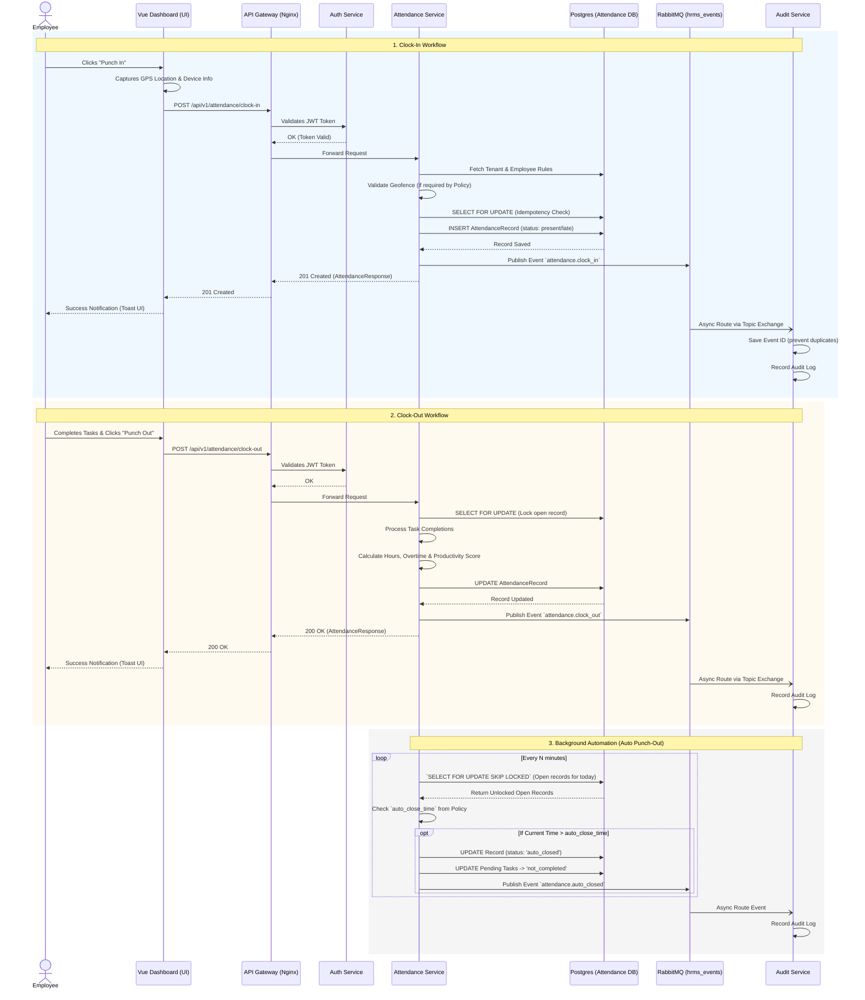

# Attendance Workflow Report

This document details the complete flow of the Attendance module in the OphilliaHRMS platform, from the moment an employee punches in to background automation details. It includes a sequence diagram tracing every microservice call and message broker interaction.

## Sequence Diagram: Punch-In & Punch-Out Flow

---

## Process Overview & Actors

### Actors Involved
1. **Employee**: The end-user initiating the punch-in/out via the Vue Frontend Dashboard.
2. **Attendance Service (Scheduler)**: An automated background process responsible for enforcing policies (like auto punch-out).
3. **Audit Service**: Reconciles and records all business processes accurately behind the scenes.
4. **API Gateway / Auth Service**: Transparent enforcers of identity and routing.

---

### Step-by-Step Breakdown

#### 1. "Punch In" (Clock-in)
- **Frontend Action**: The Vue frontend retrieves the user's location via the browser's Geolocation API (alongside device data) and initiates a REST `POST` to `/attendance/clock-in`.
- **Validation Route**: The API Gateway forwards this to the Attendance Service after the Auth Service transparently validates the JWT role/tenant.
- **Service Logic**: 
  - **Policy Resolution**: Looks up policy to see if Geofence rules apply and evaluates lat/lng against `radius_meters`.
  - **Concurrency Control**: Applies a pessimistic database lock `SELECT FOR UPDATE` on the DB to prevent double-punch scenarios resulting from race conditions.
  - **Metrics**: Computes whether the employee is "present" or "late" against the required `work_start_time`.
- **Completion**: 
  - The record is committed.
  - A fire-and-forget message (`attendance.clock_in`) is published to RabbitMQ.
  - A 201 response triggers a success Toast Notification on the Vue.js interface to visually notify the user.

#### 2. "Punch Out" (Clock-out)
- **Frontend Action**: A user completes their assigned tasks for the day, submits final day ratings/notes, and triggers `/attendance/clock-out`.
- **Service Logic**:
  - Requires all daily tasks to be transitioned away from `pending`. If any task is pending, the request is actively rejected.
  - Evaluates total time elapsed, calculating `work_hours` and `overtime_hours`.
  - Dynamically updates the employee’s status (e.g., to `half_day` if hours didn’t meet the minimum threshold).
  - Calculates a real-time **Productivity Score** dynamically derived from 50% task completion efficiency, 25% personal rating, and 25% expected hour limits.
- **Completion**:
  - The record receives a `status: completed` and the DB is committed.
  - RabbitMQ routes the `attendance.clock_out` message to the Audit Event Bus.
  - The frontend confirms this completion via UI widgets/animations upon receiving the 200 HTTP response. 

---

### Background Automation & Schedulers

OpilliaHRMS utilizes an asynchronous fail-safe cron implementation for incomplete shifts: **The Auto Punch-Out mechanism**.

1. **How it Works**:
   - Driven by the function `auto_close_stale_records()`, the scheduler probes the database continuously to find records that lack a `clock_out` timestamp on the present day.
   - Using PostgreSQL’s `SKIP LOCKED` capability, multiple scheduler worker nodes can coexist without attempting to modify the exact same attendance record concurrently.

2. **Policy Enforcement**:
   - The scheduler dynamically probes the `auto_close_time` per employee. If an employee's time breaches this mark (typically `23:59`), the system forcefully intervenes.

3. **System Adjustments**:
   - `work_hours` are auto-calculated up until this point.
   - Any remaining `pending` tasks are retroactively pushed into a `not_completed` state with system notes: *“Auto-closed: employee did not punch out”*.
   - A distinct event, `attendance.auto_closed`, is triggered and routed to the Audit log natively identifying the system as the initiator. 

### Who gets Notified?
- **Real-time Notifications**: Currently, the employee interacts synchronously with the API Response — the Vue app itself handles standard success state visuals natively via immediate API payload success codes (e.g. `201`/`200`). 
- **Admin Audit Trail**: Business-level alerts are asynchronously offloaded completely. RabbitMQ broadcasts `attendance.*` to the **Audit Service Consumer**, creating undeniable, searchable records that Super Admins and HR can query in the future.
- **Exceptions (Future scope)**: The Notification service's message handlers are equipped to be easily expanded; while currently routing email payload triggers for *Leaves, Payroll, and Onboarding*, adding trigger rules for `attendance.auto_closed` to directly ping a Manager or Employee via Email/App push would fit neatly in its DLQ-supported `consumers.py` architecture.
