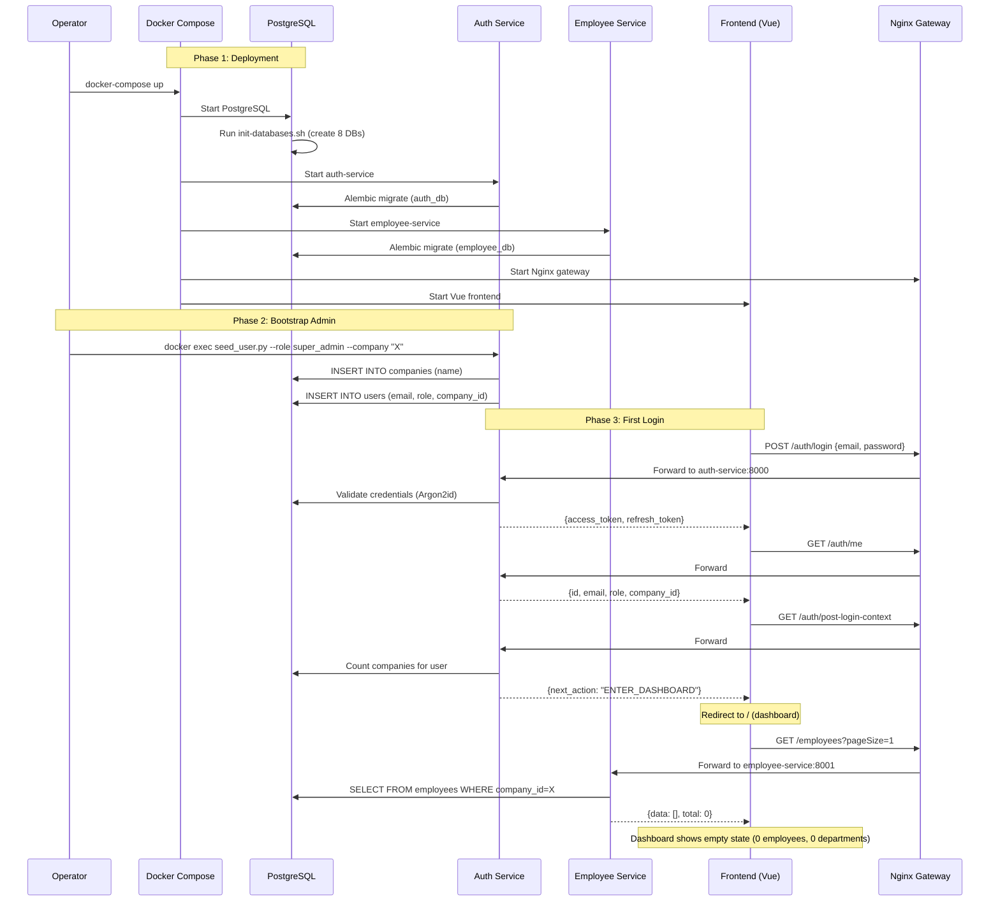

# 01 — Current Flow Analysis (As-Is System)

## First-Time Deployment Sequence

When a fresh OphilliaHRMS instance is deployed via `docker-compose up`, the following happens:

### Step 1: Infrastructure Boot
```
PostgreSQL starts → init-databases.sh runs → Creates 8 databases:
  auth_db, employee_db, attendance_db, students_db,
  leave_db, notification_db, audit_db, payroll_db
```

### Step 2: Service Startup
Each service waits for PostgreSQL health check, then:
1. Runs Alembic migrations (`alembic upgrade head`) automatically
2. Creates tables in its respective database
3. Starts FastAPI server on its assigned port

**Services and ports:**
| Service | Port | Database | Profile |
|---------|------|----------|---------|
| Auth | 8000 | auth_db | core |
| Employee | 8001 | employee_db | hr |
| Attendance | 8002 | attendance_db | hr |
| Students | 8003 | students_db | student |
| Payroll | 8004 | payroll_db | hr |
| Leave | 8005 | leave_db | hr |
| Audit | 8006 | audit_db | core |
| Notification | 8007 | notification_db | core |
| Gateway (Nginx) | 80 | — | core |
| Frontend (Vue) | 3000 | — | core |

### Step 3: Manual Admin Bootstrap (Required)
There is **no automated first-user creation**. An operator must run:
```bash
docker exec hrms-auth python seed_user.py \
  --email admin@example.com \
  --prompt-password \
  --role super_admin \
  --company "My Company"
```

This script:
- Creates a `Company` record if the name doesn't exist
- Creates a `User` record with `role=super_admin` and `company_id` linked
- Validates password strength (min 10 chars, uppercase, lowercase, digit, special)

**No other data is created.** No departments, leave types, salary structures, or policies.

---

## First Login Flow

### API Sequence

```
1. POST /api/v1/auth/login
   Body: { email, password }
   Returns: { access_token, refresh_token, token_type }

2. GET /api/v1/auth/me
   Header: Authorization: Bearer <access_token>
   Returns: { id, email, role, company_id, is_active }

3. GET /api/v1/auth/post-login-context
   Header: Authorization: Bearer <access_token>
   Returns: { role, companies, next_action, selected_company }
```

### Post-Login Context Decision Logic

The backend evaluates the user's state and returns a `next_action`:

| Condition | next_action | Frontend Route |
|-----------|-------------|----------------|
| Super admin + 0 companies | `CREATE_COMPANY` | `/create-company` |
| Super admin + 1 company | `ENTER_DASHBOARD` | `/` (dashboard) |
| Super admin + 2+ companies | `SELECT_COMPANY` | `/select-company` |
| Non-admin (HR/Manager/Employee) | `ENTER_DASHBOARD` | `/` (dashboard) |

### Company Creation (If Triggered)

```
4. POST /api/v1/auth/companies
   Body: { name, domain? }
   Rate Limit: 3 requests/hour
   Returns: { id, name, domain, is_active, created_at }
```

**What happens after company creation:**
- Company record saved in `auth_db.companies`
- Frontend redirects to dashboard
- **Nothing else.** No events published. No other services notified.

### Company Selection (If Multiple Companies)

```
4. POST /api/v1/auth/select-company
   Body: { company_id }
   Returns: New access_token + refresh_token (company-scoped)
```

---

## Sequence Diagram (Mermaid)



---

## Database State After First Login

### auth_db
| Table | Records |
|-------|---------|
| companies | 1 (created by seed script) |
| users | 1 (super_admin) |
| refresh_tokens | 1 (from login) |
| magic_tokens | 0 |

### All Other Databases
| Table | Records |
|-------|---------|
| employees | 0 |
| departments | 0 |
| attendance_records | 0 |
| leave_types | 0 |
| salary_structures | 0 |
| holidays | 0 |
| Everything else | 0 |

**The system is fully empty except for 1 company and 1 user.**

---

## Key Files Involved

| Component | File |
|-----------|------|
| DB init script | `infra/init-databases.sh` |
| Seed script | `services/auth-service/seed_user.py` |
| Auth routes | `services/auth-service/app/api/v1/endpoints/auth_routes.py` |
| Auth service logic | `services/auth-service/app/services/auth_service.py` |
| Company + User models | `services/auth-service/app/models/user.py` |
| Post-login context | `services/auth-service/app/services/auth_service.py` |
| Frontend router | `frontend-tailless-ophillia-hrms-vue/src/router/index.ts` |
| Auth store | `frontend-tailless-ophillia-hrms-vue/src/store/auth.store.ts` |
| Login page | `frontend-tailless-ophillia-hrms-vue/src/pages/Login.vue` |
| Create company page | `frontend-tailless-ophillia-hrms-vue/src/pages/CreateCompany.vue` |
| Dashboard | `frontend-tailless-ophillia-hrms-vue/src/pages/Dashboard.vue` |
| Docker Compose | `docker-compose.yml` |
| Nginx config | `services/gateway/nginx/nginx.conf` |
