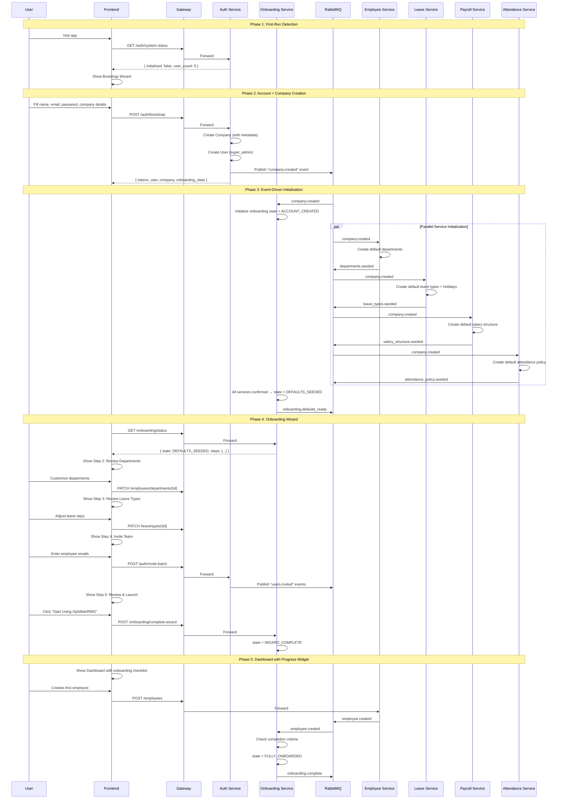

# 05 — Ideal Industry-Standard Flow (To-Be System)

## Design Principles

Modeled after onboarding flows from Stripe, Notion, Slack, and Gusto:

1. **Zero-to-value in under 3 minutes** — user should see meaningful UI within 3 minutes of first visit
2. **Progressive disclosure** — don't overwhelm; show what's needed now, hide what's needed later
3. **Smart defaults** — pre-fill everything possible; let users customize later
4. **Resumable** — onboarding state persists; users can pause and come back
5. **Event-driven initialization** — services react to events, not orchestrated by one monolith

---

## Ideal Onboarding Flow Steps

### Step 1: First-Run Detection
```
User visits app → Frontend checks /auth/system-status
  → If system has 0 users: Show "Setup Your Instance" page
  → If system has users but user not logged in: Show Login page
  → If logged in but onboarding incomplete: Resume onboarding
  → If logged in and onboarding complete: Dashboard
```

### Step 2: Account + Company Creation (Combined)
Instead of separate "register" and "create company" flows:

```
Single wizard page:
  ┌─────────────────────────────────────┐
  │  Welcome to OphilliaHRMS            │
  │                                     │
  │  Your Details                       │
  │  [Full Name        ]                │
  │  [Email            ]                │
  │  [Password         ]                │
  │                                     │
  │  Your Organization                  │
  │  [Company Name     ]                │
  │  [Industry     ▾   ]               │
  │  [Employee Count ▾  ]              │
  │  [Country      ▾   ]               │
  │  [Timezone     ▾   ]               │
  │                                     │
  │  [ Create Account & Get Started → ] │
  └─────────────────────────────────────┘
```

**API Call:** `POST /auth/bootstrap` (new endpoint)
- Creates company with metadata
- Creates super_admin user
- Publishes `CompanyCreated` event to RabbitMQ
- Returns tokens
- Available **only when 0 users exist** (self-disabling endpoint)

### Step 3: Event-Driven Initialization

When `CompanyCreated` event is published:

```
RabbitMQ: company.created
  │
  ├─→ Employee Service: Create default departments
  │     - Human Resources, Engineering, Finance, Operations
  │
  ├─→ Leave Service: Create default leave types + holiday calendar
  │     - Sick Leave (12 days), Casual Leave (12), Earned Leave (15)
  │     - National holidays based on country selection
  │
  ├─→ Payroll Service: Create default salary structure template
  │     - Basic (50%), HRA (20%), Allowances (15%)
  │     - Standard deductions (PF 12%, ESI 1.75%)
  │
  ├─→ Attendance Service: Create default attendance policy
  │     - Method: manual, Work hours: 8, Start time: 09:00
  │
  ├─→ Notification Service: Create default preferences
  │     - Email enabled for all event types
  │
  └─→ Onboarding Service: Initialize onboarding state
        - Mark "Account Created" ✓
        - Mark "Company Created" ✓
        - Mark "Defaults Provisioned" ✓ (after all services confirm)
```

### Step 4: Onboarding Wizard (Frontend)

After account creation, show a step-by-step wizard:

```
┌─────────────────────────────────────────────┐
│  Set Up Your Organization     Step 2 of 5   │
│  ═══════════════●━━━━━━━━━━━━━━━━━━━━━━━━   │
│                                             │
│  📋 Review Your Departments                 │
│                                             │
│  We've created starter departments for you. │
│  Add, rename, or remove as needed.          │
│                                             │
│  ✓ Human Resources                          │
│  ✓ Engineering                              │
│  ✓ Finance                                  │
│  ✓ Operations                               │
│  + Add Department                           │
│                                             │
│  [ ← Back ]              [ Next Step → ]    │
│                          [ Skip for now ]   │
└─────────────────────────────────────────────┘
```

**Wizard Steps:**
1. **Company Details** — Review/edit company info (already filled from signup)
2. **Departments** — Review default departments, add/remove
3. **Leave Policy** — Review default leave types, customize days
4. **Invite Team** — Add first employees by email (batch invite)
5. **Review & Launch** — Summary + "Start Using OphilliaHRMS"

### Step 5: Dashboard with Onboarding Widget

After wizard completion (or skip), the dashboard shows a persistent onboarding widget:

```
┌─────────────────────────────────────────────┐
│  🚀 Getting Started          75% Complete   │
│  ═══════════════════════════●━━━━━━━━━━━━   │
│                                             │
│  ✓ Create your account                      │
│  ✓ Set up company                           │
│  ✓ Configure departments                    │
│  ○ Add your first employee                  │
│  ○ Set up attendance tracking               │
│  ○ Configure payroll                        │
│                                             │
│  [ Continue Setup ]        [ Dismiss ]      │
└─────────────────────────────────────────────┘
```

### Step 6: Role & Permission Verification

After first employees are added, verify that roles are correctly assigned:
- Super Admin sees all modules
- HR sees HR modules
- Managers see team-scoped views
- Employees see self-service only

### Step 7: Feature Initialization Complete

Mark onboarding as complete when:
- At least 1 department exists
- At least 1 employee exists (besides the admin)
- Leave types are configured
- Attendance policy exists

Hide the onboarding widget. Show a "Setup Complete" celebration.

---

## Onboarding State Machine

```
┌─────────────────┐
│  NOT_STARTED     │ ──→ User visits app for first time
└────────┬────────┘
         │ bootstrap endpoint called
         ▼
┌─────────────────┐
│  ACCOUNT_CREATED │ ──→ User + Company exist
└────────┬────────┘
         │ CompanyCreated event processed by all services
         ▼
┌─────────────────┐
│  DEFAULTS_SEEDED │ ──→ Default data provisioned
└────────┬────────┘
         │ User completes or skips wizard
         ▼
┌─────────────────┐
│  WIZARD_COMPLETE │ ──→ Basic setup done
└────────┬────────┘
         │ User adds first employee + configures key features
         ▼
┌─────────────────┐
│  FULLY_ONBOARDED │ ──→ System ready for daily use
└─────────────────┘

At any step, user can:
  → Skip to dashboard (state saved, can resume)
  → Log out and come back (state persisted in DB)
```

### State Transitions Table

| Current State | Event | Next State |
|---------------|-------|------------|
| `NOT_STARTED` | `bootstrap_completed` | `ACCOUNT_CREATED` |
| `ACCOUNT_CREATED` | `all_services_confirmed_seed` | `DEFAULTS_SEEDED` |
| `DEFAULTS_SEEDED` | `wizard_completed` OR `wizard_skipped` | `WIZARD_COMPLETE` |
| `WIZARD_COMPLETE` | `first_employee_added` AND `policies_configured` | `FULLY_ONBOARDED` |

---

## Improved Sequence Diagram



---

## Frontend Route Structure (To-Be)

```
/                          → Dashboard (authenticated)
/login                     → Login page (public)
/setup                     → Bootstrap wizard (public, only if 0 users)
/onboarding                → Onboarding wizard (authenticated)
/onboarding/departments    → Step 2: Departments
/onboarding/leave-policy   → Step 3: Leave policy
/onboarding/invite-team    → Step 4: Invite team
/onboarding/review         → Step 5: Review & launch
/create-company            → Create company (keep for SaaS multi-company)
/select-company            → Select company (keep for SaaS multi-company)
```

---

## Key Design Decisions

| Decision | Rationale |
|----------|-----------|
| Combined signup + company creation | Reduces steps from 3 (register → login → create company) to 1 |
| Self-disabling bootstrap endpoint | Security: only available when 0 users exist |
| Event-driven seeding (not API calls) | Decoupled: auth service doesn't need to know about leave types or departments |
| Wizard steps are skippable | Respects user autonomy; state machine tracks what was skipped |
| Dashboard onboarding widget | Persistent gentle reminder without blocking the user |
| Onboarding service as separate microservice | Single responsibility; can be replaced or disabled without affecting core services |
